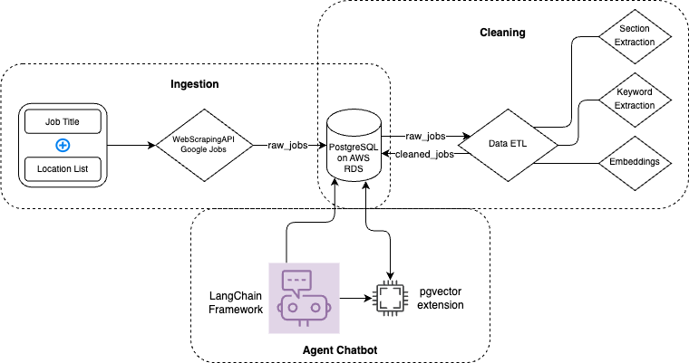

# 🚀 Data Job Insights: Unlock Your Career Potential! 📊

Are you ready to take your data career to the next level? Look no further! This project is here to revolutionize the way you approach your job search and resume optimization. By leveraging the power of an advanced Language Model (LLM), we've created a game-changing tool that will give you the inside scoop on what employers are really looking for in data-related roles. 💡

## 🎯 What's the Goal?

Our mission is to build a comprehensive database of job descriptions for various data-related positions, including:

- Data Scientist 🔬
- Data Engineer ⚙️
- Data Analyst 📈
- Machine Learning Engineer 🤖
- And more! 💼

But we're not just collecting job postings – we're taking it to the next level! Our cutting-edge LLM will parse each job description and extract key information, giving you unparalleled insights into what skills, experiences, and qualities are most sought-after in the industry. 🔍

## 🛠️ How Does It Work?

We've designed a robust system using Pydantic models to capture and structure the most important aspects of each job description. Here's a quick overview of what we're extracting:

### 🏢 Company Overview

- About the company, its industry, products, and services
- Mission, values, and culture
- Company size and locations

### 📝 Role Summary

- Job title and team/department
- Role type (full-time, part-time, contract, etc.)
- Remote work options

### 📋 Responsibilities and Qualifications

- Core duties and expectations
- Required educational background and experience
- Preferred skills and characteristics

### 💰 Compensation and Benefits

- Salary or pay range
- Bonus and equity compensation
- Benefits and perks

With this wealth of information at your fingertips, you'll be able to tailor your resume and interview responses to perfectly match what employers are looking for! 🎯

## 🔮 What's Next?

We're just getting started! In the near future, we'll be adding even more powerful features to help you land your dream data job:

- [ ] Automatically categorize job descriptions based on key characteristics
- [ ] Provide personalized resume suggestions based on your target roles
- [ ] Offer insider tips and strategies for acing data job interviews

Stay tuned for these exciting updates! 🚀

## 🤝 Get Involved!

We believe in the power of community and collaboration. If you're passionate about data careers and want to contribute to this project, we'd love to have you on board! Whether you're a data professional, a machine learning enthusiast, or just excited about the potential of this tool, there's a place for you here. 

Feel free to submit pull requests, suggest new features, or simply share your experiences and insights. Together, we can help data professionals everywhere unlock their full career potential! 💪

So what are you waiting for? Dive in, explore the codebase, and let's revolutionize the world of data jobs together! 🌟